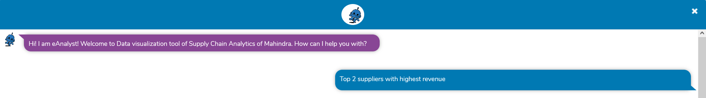
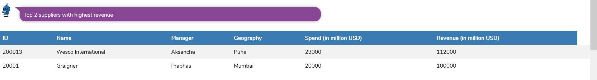
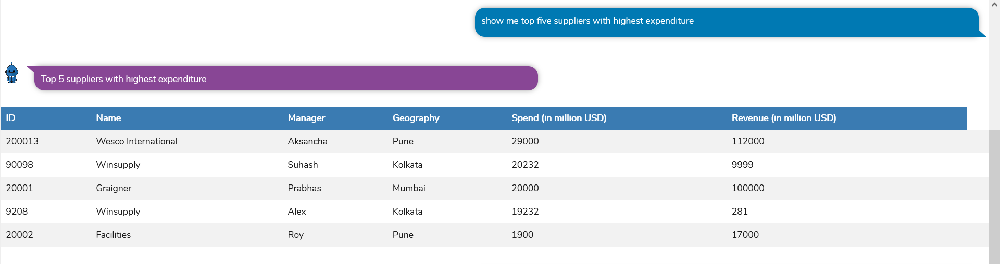
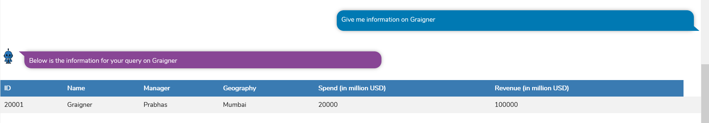
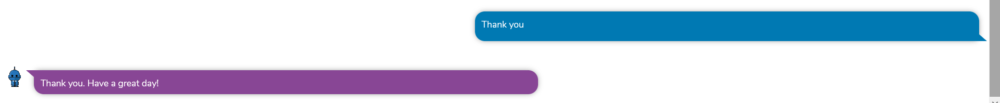

# eAnalyst Bot

eAnalyst Chatbot is a built using DialogFlow. The purpose of the bot is to provide information on different supply chains.

## Steps to run the code

1. Clone the project in directory
2. cd directory
3. Run "npm install"
4. Run "npm run start"

Then go to the browser and enter the url <a>http://localhost:3001/</a>

eAnalyst Chatbot Link : http://ec2-3-16-130-69.us-east-2.compute.amazonaws.com:5000/

## Screenshots

 

